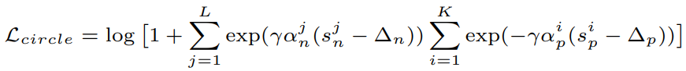

# Losses
All loss functions are used as follows:

```python
from pytorch_metric_learning import losses
loss_func = losses.SomeLoss()
loss = loss_func(embeddings, labels) # in your training for-loop
```

Or if you are using a loss in conjunction with a [miner](miners.md):

```python
from pytorch_metric_learning import miners
miner_func = miners.SomeMiner()
loss_func = losses.SomeLoss()
miner_output = miner_func(embeddings, labels) # in your training for-loop
loss = loss_func(embeddings, labels, miner_output)
```

For some losses, you don't need to pass in labels if you are already passing in pair/triplet indices:
```python
loss = loss_func(embeddings, indices_tuple=pairs)
# it also works with ref_emb
loss = loss_func(embeddings, indices_tuple=pairs, ref_emb=ref_emb)
```
??? note "Losses for which you can pass in `indices_tuple` without `labels`"
    - CircleLoss
    - ContrastiveLoss
    - IntraPairVarianceLoss
    - GeneralizedLiftedStructureLoss
    - LiftedStructureLoss
    - MarginLoss
    - MultiSimilarityLoss
    - NTXentLoss
    - SignalToNoiseRatioContrastiveLoss
    - SupConLoss
    - TripletMarginLoss
    - TupletMarginLoss


You can specify how losses get reduced to a single value by using a [reducer](reducers.md):
```python
from pytorch_metric_learning import reducers
reducer = reducers.SomeReducer()
loss_func = losses.SomeLoss(reducer=reducer)
loss = loss_func(embeddings, labels) # in your training for-loop
```

For tuple losses, you can separate the source of anchors and positives/negatives:
```python
loss_func = losses.SomeLoss()
# anchors will come from embeddings
# positives/negatives will come from ref_emb
loss = loss_func(embeddings, labels, ref_emb=ref_emb, ref_labels=ref_labels)
```

For classification losses, you can get logits using the ```get_logits``` function:
```python
loss_func = losses.SomeClassificationLoss()
logits = loss_func.get_logits(embeddings)
```


## AngularLoss 
[Deep Metric Learning with Angular Loss](https://arxiv.org/pdf/1708.01682.pdf){target=_blank}
```python
losses.AngularLoss(alpha=40, **kwargs)
```
**Equation**:

{: style="height:200px"}


**Parameters**:

* **alpha**: The angle specified in degrees. The paper uses values between 36 and 55.

**Default distance**: 

 - [```LpDistance(p=2, power=1, normalize_embeddings=True)```](distances.md#lpdistance)

     - This is the only compatible distance.

**Default reducer**: 

 - [MeanReducer](reducers.md#meanreducer)

**Reducer input**:

* **loss**: The loss for every ```a1```, where ```(a1,p)``` represents every positive pair in the batch. Reduction type is ```"element"```.


## ArcFaceLoss 
[ArcFace: Additive Angular Margin Loss for Deep Face Recognition](https://arxiv.org/pdf/1801.07698.pdf){target=_blank}

```python
losses.ArcFaceLoss(num_classes, embedding_size, margin=28.6, scale=64, **kwargs)
```

**Equation**:

{: style="height:80px"}


**Parameters**:

* **num_classes**: The number of classes in your training dataset.
* **embedding_size**: The size of the embeddings that you pass into the loss function. For example, if your batch size is 128 and your network outputs 512 dimensional embeddings, then set ```embedding_size``` to 512.
* **margin**: The angular margin penalty in degrees. In the above equation, ```m = radians(margin)```. The paper uses 0.5 radians, which is 28.6 degrees.
* **scale**: This is ```s``` in the above equation. The paper uses 64.

**Other info**: 

* This also extends [WeightRegularizerMixin](losses.md#weightregularizermixin), so it accepts ```weight_regularizer```, ```weight_reg_weight```, and ```weight_init_func``` as optional arguments.
* This loss **requires an optimizer**. You need to create an optimizer and pass this loss's parameters to that optimizer. For example:
```python
loss_func = losses.ArcFaceLoss(...).to(torch.device('cuda'))
loss_optimizer = torch.optim.SGD(loss_func.parameters(), lr=0.01)
# then during training:
loss_optimizer.step()
```

**Default distance**: 

 - [```CosineSimilarity()```](distances.md#cosinesimilarity)
     - This is the only compatible distance.

**Default reducer**: 

 - [MeanReducer](reducers.md#meanreducer)

**Reducer input**:

* **loss**: The loss per element in the batch. Reduction type is ```"element"```.


## BaseMetricLossFunction
All loss functions extend this class and therefore inherit its ```__init__``` parameters.

```python
losses.BaseMetricLossFunction(collect_stats = False, 
							reducer = None, 
							distance = None, 
							embedding_regularizer = None,
							embedding_reg_weight = 1)
```

**Parameters**:

* **collect_stats**: If True, will collect various statistics that may be useful to analyze during experiments. If False, these computations will be skipped. Want to make ```True``` the default? Set the global [COLLECT_STATS](common_functions.md#collect_stats) flag.
* **reducer**: A [reducer](reducers.md) object. If None, then the default reducer will be used.
* **distance**: A [distance](distances.md) object. If None, then the default distance will be used.
* **embedding_regularizer**: A [regularizer](regularizers.md) object that will be applied to embeddings. If None, then no embedding regularization will be used.
* **embedding_reg_weight**: If an embedding regularizer is used, then its loss will be multiplied by this amount before being added to the total loss.

**Default distance**: 

 - [```LpDistance(normalize_embeddings=True, p=2, power=1)```](distances.md#lpdistance)

**Default reducer**: 

- [MeanReducer](reducers.md#meanreducer)

**Reducer input**:

* **embedding_reg_loss**: Only exists if an embedding regularizer is used. It contains the loss per element in the batch. Reduction type is ```"already_reduced"```. 


**Required Implementations**:
```python
def compute_loss(self, embeddings, labels, indices_tuple, ref_emb, ref_labels):
    raise NotImplementedError
```


## CircleLoss 
[Circle Loss: A Unified Perspective of Pair Similarity Optimization](https://arxiv.org/pdf/2002.10857.pdf){target=_blank}

```python
losses.CircleLoss(m=0.4, gamma=80, **kwargs)
```

**Equations**:

{: style="height:60px"}

where

{: style="height:70px"}

{: style="height:25px"}

{: style="height:25px"}

{: style="height:25px"}

{: style="height:25px"}


**Parameters**:

* **m**: The relaxation factor that controls the radius of the decision boundary. The paper uses 0.25 for face recognition, and 0.4 for fine-grained image retrieval (images of birds, cars, and online products).
* **gamma**: The scale factor that determines the largest scale of each similarity score. The paper uses 256 for face recognition, and 80 for fine-grained image retrieval.

**Default distance**: 

 - [```CosineSimilarity()```](distances.md#cosinesimilarity)

    - This is the only compatible distance.

**Default reducer**: 

 - [AvgNonZeroReducer](reducers.md#avgnonzeroreducer)

**Reducer input**:

* **loss**: The loss per element in the batch. Reduction type is ```"element"```.

## ContrastiveLoss
```python
losses.ContrastiveLoss(pos_margin=0, neg_margin=1, **kwargs):
```

**Equation**:

If using a distance metric like [LpDistance](distances.md#lpdistance), the loss is:

{: style="height:37px"}

If using a similarity metric like [CosineSimilarity](distances.md#cosinesimilarity), the loss is:

{: style="height:35px"}

**Parameters**:

* **pos_margin**: The distance (or similarity) over (under) which positive pairs will contribute to the loss.
* **neg_margin**: The distance (or similarity) under (over) which negative pairs will contribute to the loss.  

Note that the default values for ```pos_margin``` and ```neg_margin``` are suitable if you are using a non-inverted distance measure, like [LpDistance](distances.md#lpdistance). If you use an inverted distance measure like [CosineSimilarity](distances.md#cosinesimilarity), then more appropriate values would be ```pos_margin = 1``` and ```neg_margin = 0```.

**Default distance**: 

 - [```LpDistance(normalize_embeddings=True, p=2, power=1)```](distances.md#lpdistance)

**Default reducer**: 

 - [AvgNonZeroReducer](reducers.md#avgnonzeroreducer)

**Reducer input**:

* **pos_loss**: The loss per positive pair in the batch. Reduction type is ```"pos_pair"```.
* **neg_loss**: The loss per negative pair in the batch. Reduction type is ```"neg_pair"```.


## CosFaceLoss 
[CosFace: Large Margin Cosine Loss for Deep Face Recognition](https://arxiv.org/pdf/1801.09414.pdf){target=_blank}

```python
losses.CosFaceLoss(num_classes, embedding_size, margin=0.35, scale=64, **kwargs)
```

**Equation**:

{: style="height:80px"}

**Parameters**:

* **num_classes**: The number of classes in your training dataset.
* **embedding_size**: The size of the embeddings that you pass into the loss function. For example, if your batch size is 128 and your network outputs 512 dimensional embeddings, then set ```embedding_size``` to 512.
* **margin**: The cosine margin penalty (m in the above equation). The paper used values between 0.25 and 0.45.
* **scale**: This is ```s``` in the above equation. The paper uses 64.

**Other info**: 

* This also extends [WeightRegularizerMixin](losses.md#weightregularizermixin), so it accepts ```weight_regularizer```, ```weight_reg_weight```, and ```weight_init_func``` as optional arguments.
* This loss **requires an optimizer**. You need to create an optimizer and pass this loss's parameters to that optimizer. For example:
```python
loss_func = losses.CosFaceLoss(...).to(torch.device('cuda'))
loss_optimizer = torch.optim.SGD(loss_func.parameters(), lr=0.01)
# then during training:
loss_optimizer.step()
```

**Default distance**: 

 - [```CosineSimilarity()```](distances.md#cosinesimilarity)

    - This is the only compatible distance.

**Default reducer**: 

 - [MeanReducer](reducers.md#meanreducer)

**Reducer input**:

* **loss**: The loss per element in the batch. Reduction type is ```"element"```.


## CrossBatchMemory 
This wraps a loss function, and implements [Cross-Batch Memory for Embedding Learning](https://arxiv.org/pdf/1912.06798.pdf){target=_blank}. It stores embeddings from previous iterations in a queue, and uses them to form more pairs/triplets with the current iteration's embeddings.

```python
losses.CrossBatchMemory(loss, embedding_size, memory_size=1024, miner=None)
```

**Parameters**:

* **loss**: The loss function to be wrapped. For example, you could pass in ```ContrastiveLoss()```.
* **embedding_size**: The size of the embeddings that you pass into the loss function. For example, if your batch size is 128 and your network outputs 512 dimensional embeddings, then set ```embedding_size``` to 512.
* **memory_size**: The size of the memory queue.
* **miner**: An optional [tuple miner](miners.md), which will be used to mine pairs/triplets from the memory queue.

**Forward function**
```python
loss_fn(embeddings, labels, indices_tuple=None, enqueue_mask=None)
```

As shown above, CrossBatchMemory comes with a 4th argument in its ```forward``` function:

* **enqueue_mask**: A boolean tensor where `enqueue_mask[i]` is True if `embeddings[i]` should be added to the memory queue. This enables CrossBatchMemory to be used in self-supervision frameworks like [MoCo](https://arxiv.org/pdf/1911.05722.pdf). Check out the [MoCo on CIFAR100](https://github.com/KevinMusgrave/pytorch-metric-learning/tree/master/examples#simple-examples) notebook to see how this works.


??? note "Supported Loss Functions"
    - [AngularLoss](losses.md#angularloss)
    - [CircleLoss](losses.md#circleloss)
    - [ContrastiveLoss](losses.md#contrastiveloss)
    - [GeneralizedLiftedStructureLoss](losses.md#generalizedliftedstructureloss)
    - [IntraPairVarianceLoss](losses.md#intrapairvarianceloss)
    - [LiftedStructureLoss](losses.md#liftedstructureloss)
    - [MarginLoss](losses.md#marginloss)
    - [MultiSimilarityLoss](losses.md#multisimilarityloss)
    - [NCALoss](losses.md#ncaloss)
    - [NTXentLoss](losses.md#ntxentloss)
    - [SignalToNoiseRatioContrastiveLoss](losses.md#signaltonoiseratiocontrastiveloss)
    - [SupConLoss](losses.md#supconloss)
    - [TripletMarginLoss](losses.md#tripletmarginloss)
    - [TupletMarginLoss](losses.md#tupletmarginloss)


**Reset queue**

The queue can be cleared like this:
```python
loss_fn.reset_queue()
```

## FastAPLoss
[Deep Metric Learning to Rank](http://openaccess.thecvf.com/content_CVPR_2019/papers/Cakir_Deep_Metric_Learning_to_Rank_CVPR_2019_paper.pdf){target=_blank}

```python
losses.FastAPLoss(num_bins=10, **kwargs)
```

**Parameters**:

* **num_bins**: The number of soft histogram bins for calculating average precision. The paper suggests using 10.

**Default distance**:

- [```LpDistance(normalize_embeddings=True, p=2, power=2)```](distances.md#lpdistance)
    - The only compatible distance is ```LpDistance(normalize_embeddings=True, p=2)```. However, the ```power``` value can be changed.

**Default reducer**: 

 - [MeanReducer](reducers.md#meanreducer)

**Reducer input**:

* **loss**: The loss per element that has at least 1 positive in the batch. Reduction type is ```"element"```.


## GenericPairLoss
```python
losses.GenericPairLoss(mat_based_loss, **kwargs)
```
**Parameters**:

* **mat_based_loss**: See required implementations.

**Required Implementations**:
```python
# If mat_based_loss is True, then this takes in mat, pos_mask, neg_mask
# If False, this takes in pos_pair, neg_pair, indices_tuple
def _compute_loss(self):
    raise NotImplementedError
```

## GeneralizedLiftedStructureLoss
This was presented in [In Defense of the Triplet Loss for Person Re-Identification](https://arxiv.org/pdf/1703.07737.pdf){target=_blank}. It is a modification of the original [LiftedStructureLoss](losses.md#liftedstructureloss)

```python
losses.GeneralizedLiftedStructureLoss(neg_margin=1, pos_margin=0, **kwargs)
```
**Equation**:

{: style="height:250px"}

**Parameters**:

* **pos_margin**: The margin in the expression ```e^(D - margin)```. The paper uses ```pos_margin = 0 ```, which is why this margin does not appear in the above equation.
* **neg_margin**: This is ```m``` in the above equation. The paper used values between 0.1 and 1.

**Default distance**: 

 - [```LpDistance(normalize_embeddings=True, p=2, power=1)```](distances.md#lpdistance)

**Default reducer**: 

 - [MeanReducer](reducers.md#meanreducer)

**Reducer input**:

* **loss**: The loss per element in the batch. Reduction type is ```"element"```.

## InstanceLoss
[Dual-Path Convolutional Image-Text Embeddings with Instance Loss](https://arxiv.org/pdf/1711.05535.pdf)
```python
losses.InstanceLoss(gamma=64, **kwargs)
```

**Parameters**:

* **gamma**: The cosine similarity matrix is scaled by this amount.


## IntraPairVarianceLoss
[Deep Metric Learning with Tuplet Margin Loss](http://openaccess.thecvf.com/content_ICCV_2019/papers/Yu_Deep_Metric_Learning_With_Tuplet_Margin_Loss_ICCV_2019_paper.pdf){target=_blank}
```python
losses.IntraPairVarianceLoss(pos_eps=0.01, neg_eps=0.01, **kwargs)
```

**Equations**:

{: style="height:39px"}

{: style="height:34px"}

**Parameters**:

* **pos_eps**: The epsilon in the L<sub>pos</sub> equation. The paper uses 0.01.
* **neg_eps**: The epsilon in the L<sub>neg</sub> equation. The paper uses 0.01.

You should probably use this in conjunction with another loss, as described in the paper. You can accomplish this by using [MultipleLosses](losses.md#multiplelosses):
```python
main_loss = losses.TupletMarginLoss()
var_loss = losses.IntraPairVarianceLoss()
complete_loss = losses.MultipleLosses([main_loss, var_loss], weights=[1, 0.5])
```

**Default distance**: 

 - [```LpDistance(normalize_embeddings=True, p=2, power=1)```](distances.md#lpdistance)

**Default reducer**: 

 - [MeanReducer](reducers.md#meanreducer)

**Reducer input**:

* **pos_loss**: The loss per positive pair in the batch. Reduction type is ```"pos_pair"```.
* **neg_loss**: The loss per negative pair in the batch. Reduction type is ```"neg_pair"```.


## LargeMarginSoftmaxLoss
[Large-Margin Softmax Loss for Convolutional Neural Networks](https://arxiv.org/pdf/1612.02295.pdf){target=_blank}

```python
losses.LargeMarginSoftmaxLoss(num_classes, 
                            embedding_size, 
                            margin=4, 
                            scale=1, 
                            **kwargs)
```

**Equations**:

{: style="height:80px"}

where

{: style="height:90px"}

**Parameters**:

* **num_classes**: The number of classes in your training dataset.
* **embedding_size**: The size of the embeddings that you pass into the loss function. For example, if your batch size is 128 and your network outputs 512 dimensional embeddings, then set ```embedding_size``` to 512.
* **margin**: An integer which dictates the size of the angular margin. This is ```m``` in the above equation. The paper finds ```m=4``` works best.
* **scale**: The exponent multiplier in the loss's softmax expression. The paper uses ```scale = 1 ```, which is why it does not appear in the above equation.

**Other info**: 

* This also extends [WeightRegularizerMixin](losses.md#weightregularizermixin), so it accepts ```weight_regularizer```, ```weight_reg_weight```, and ```weight_init_func``` as optional arguments.
* This loss **requires an optimizer**. You need to create an optimizer and pass this loss's parameters to that optimizer. For example:
```python
loss_func = losses.LargeMarginSoftmaxLoss(...).to(torch.device('cuda'))
loss_optimizer = torch.optim.SGD(loss_func.parameters(), lr=0.01)
# then during training:
loss_optimizer.step()
```

**Default distance**: 

 - [```CosineSimilarity()```](distances.md#cosinesimilarity)

    - This is the only compatible distance.

**Default reducer**: 

 - [MeanReducer](reducers.md#meanreducer)


**Reducer input**:

* **loss**: The loss per element in the batch. Reduction type is ```"element"```.


## LiftedStructureLoss
The original lifted structure loss as presented in [Deep Metric Learning via Lifted Structured Feature Embedding](https://arxiv.org/pdf/1511.06452.pdf){target=_blank}

```python
losses.LiftedStructureLoss(neg_margin=1, pos_margin=0, **kwargs):
```

**Equation**:

{: style="height:150px"}

**Parameters**:

* **pos_margin**: The margin in the expression ```D_(i,j) - margin```. The paper uses ```pos_margin = 0 ```, which is why it does not appear in the above equation.
* **neg_margin**: This is ```alpha``` in the above equation. The paper uses 1.

**Default distance**: 

 - [```LpDistance(normalize_embeddings=True, p=2, power=1)```](distances.md#lpdistance)

**Default reducer**: 

 - [MeanReducer](reducers.md#meanreducer)

**Reducer input**:

* **loss**: The loss per positive pair in the batch. Reduction type is ```"pos_pair"```.


## ManifoldLoss

[Ensemble Deep Manifold Similarity Learning using Hard Proxies](https://openaccess.thecvf.com/content_CVPR_2019/papers/Aziere_Ensemble_Deep_Manifold_Similarity_Learning_Using_Hard_Proxies_CVPR_2019_paper.pdf)

```python
losses.ManifoldLoss(
        l: int,
        K: int = 50,
        lambdaC: float = 1.0,
        alpha: float = 0.8,
        margin: float = 5e-4,
        **kwargs
    )
```

**Parameters**

- **l**: embedding size.

- **K**: number of proxies.

- **lambdaC**: regularization weight. Used in the formula `loss = intrinsic_loss + lambdaC*context_loss`.
    If `lambdaC=0`, then it uses only the intrinsic loss. If `lambdaC=np.inf`, then it uses only the context loss.

- **alpha**: parameter of the Random Walk. Must be in the range `(0,1)`. It specifies the amount of similarity between neighboring nodes.

- **margin**: margin used in the calculation of the loss.


Example usage:
```python
loss_fn = ManifoldLoss(128)

# use random cluster centers
loss = loss_fn(embeddings)
# or specify indices of embeddings to use as cluster centers
loss = loss_fn(embeddings, indices_tuple=indices)
```

**Important notes**

`labels`, `ref_emb`, and `ref_labels` are not supported for this loss function.

In addition, `indices_tuple` is **not** for the output of miners. Instead, it is for a list of indices of embeddings to be used as cluster centers.


**Default reducer**: 

 - This loss returns an **already reduced** loss.


## MarginLoss
[Sampling Matters in Deep Embedding Learning](https://arxiv.org/pdf/1706.07567.pdf){target=_blank}
```python
losses.MarginLoss(margin=0.2, 
                nu=0, 
                beta=1.2, 
                triplets_per_anchor="all", 
                learn_beta=False, 
                num_classes=None, 
                **kwargs)
```

**Equations**:

{: style="height:60px"}

where

{: style="height:40px"}


**Parameters**:

* **margin**: This is alpha in the above equation. The paper uses 0.2.
* **nu**: The regularization weight for the magnitude of beta.
* **beta**: This is beta in the above equation. The paper uses 1.2 as the initial value.
* **triplets_per_anchor**: The number of triplets per element to sample within a batch. Can be an integer or the string "all". For example, if your batch size is 128, and triplets_per_anchor is 100, then 12800 triplets will be sampled. If triplets_per_anchor is "all", then all possible triplets in the batch will be used.
* **learn_beta**: If True, beta will be a torch.nn.Parameter, which can be optimized using any PyTorch optimizer.
* **num_classes**: If not None, then beta will be of size ```num_classes```, so that a separate beta is used for each class during training.

**Default distance**: 

 - [```LpDistance(normalize_embeddings=True, p=2, power=1)```](distances.md#lpdistance)


**Default reducer**: 

 - [DivisorReducer](reducers.md#divisorreducer)

**Reducer input**:

* **margin_loss**: The loss per triplet in the batch. Reduction type is ```"triplet"```.
* **beta_reg_loss**: The regularization loss per element in ```self.beta```. Reduction type is ```"already_reduced"``` if ```self.num_classes = None```. Otherwise it is ```"element"```.


## MultiSimilarityLoss
[Multi-Similarity Loss with General Pair Weighting for Deep Metric Learning](http://openaccess.thecvf.com/content_CVPR_2019/papers/Wang_Multi-Similarity_Loss_With_General_Pair_Weighting_for_Deep_Metric_Learning_CVPR_2019_paper.pdf){target=_blank}
```python
losses.MultiSimilarityLoss(alpha=2, beta=50, base=0.5, **kwargs)
```

**Equation**:

{: style="height:150px"}


**Parameters**:

* **alpha**: The weight applied to positive pairs. The paper uses 2.
* **beta**: The weight applied to negative pairs. The paper uses 50.
* **base**: The offset applied to the exponent in the loss. This is lambda in the above equation. The paper uses 1. 

**Default distance**: 

 - [```CosineSimilarity()```](distances.md#cosinesimilarity)

**Default reducer**: 

 - [MeanReducer](reducers.md#meanreducer)

**Reducer input**:

* **loss**: The loss per element in the batch. Reduction type is ```"element"```.

## MultipleLosses
This is a simple wrapper for multiple losses. Pass in a list of already-initialized loss functions. Then, when you call forward on this object, it will return the sum of all wrapped losses.
```python
losses.MultipleLosses(losses, miners=None, weights=None)
```
**Parameters**:

* **losses**: A list or dictionary of initialized loss functions. On the forward call of MultipleLosses, each wrapped loss will be computed, and then the average will be returned.
* **miners**: Optional. A list or dictionary of mining functions. This allows you to pair mining functions with loss functions. For example, if ```losses = [loss_A, loss_B]```, and ```miners = [None, miner_B]``` then no mining will be done for ```loss_A```, but the output of ```miner_B``` will be passed to ```loss_B```. The same logic applies if ```losses = {"loss_A": loss_A, "loss_B": loss_B}``` and ```miners = {"loss_B": miner_B}```.
* **weights**: Optional. A list or dictionary of loss weights, which will be multiplied by the corresponding losses obtained by the loss functions. The default is to multiply each loss by 1. If ```losses``` is a list, then ```weights``` must be a list. If ```losses``` is a dictionary, ```weights``` must contain the same keys as ```losses```. 


## NCALoss
[Neighbourhood Components Analysis](https://www.cs.toronto.edu/~hinton/absps/nca.pdf){target=_blank}
```python
losses.NCALoss(softmax_scale=1, **kwargs)
```

**Equations**:

{: style="height:50px"}

where

{: style="height:60px"}

{: style="height:60px"}

In this implementation, we use ```-g(A)``` as the loss.

**Parameters**:

* **softmax_scale**: The exponent multiplier in the loss's softmax expression. The paper uses ```softmax_scale = 1 ```, which is why it does not appear in the above equations.

**Default distance**: 

 - [```LpDistance(normalize_embeddings=True, p=2, power=2)```](distances.md#lpdistance)

**Default reducer**: 

 - [MeanReducer](reducers.md#meanreducer)

**Reducer input**:

* **loss**: The loss per element in the batch, that results in a non zero exponent in the cross entropy expression. Reduction type is ```"element"```.


## NormalizedSoftmaxLoss
[Classification is a Strong Baseline for Deep Metric Learning](https://arxiv.org/pdf/1811.12649.pdf){target=_blank}
```python
losses.NormalizedSoftmaxLoss(num_classes, embedding_size, temperature=0.05, **kwargs)
```

**Equation**:

{: style="height:80px"}


**Parameters**:

* **num_classes**: The number of classes in your training dataset.
* **embedding_size**: The size of the embeddings that you pass into the loss function. For example, if your batch size is 128 and your network outputs 512 dimensional embeddings, then set ```embedding_size``` to 512.
* **temperature**: This is sigma in the above equation. The paper uses 0.05.

**Other info**

* This also extends [WeightRegularizerMixin](losses.md#weightregularizermixin), so it accepts ```weight_regularizer```, ```weight_reg_weight```, and ```weight_init_func``` as optional arguments.
* This loss **requires an optimizer**. You need to create an optimizer and pass this loss's parameters to that optimizer. For example:
```python
loss_func = losses.NormalizedSoftmaxLoss(...).to(torch.device('cuda'))
loss_optimizer = torch.optim.SGD(loss_func.parameters(), lr=0.01)
# then during training:
loss_optimizer.step()
```

**Default distance**: 

 - [```DotProductSimilarity()```](distances.md#dotproductsimilarity)

**Default reducer**: 

 - [MeanReducer](reducers.md#meanreducer)

**Reducer input**:

* **loss**: The loss per element in the batch. Reduction type is ```"element"```.


## NPairsLoss
[Improved Deep Metric Learning with Multi-class N-pair Loss Objective](http://www.nec-labs.com/uploads/images/Department-Images/MediaAnalytics/papers/nips16_npairmetriclearning.pdf){target=_blank}

If your batch has more than 2 samples per label, then you should use [NTXentLoss](#ntxentloss).

```python
losses.NPairsLoss(**kwargs)
```

**Default distance**: 

 - [```DotProductSimilarity()```](distances.md#dotproductsimilarity)

**Default reducer**: 

 - [MeanReducer](reducers.md#meanreducer)

**Reducer input**:

* **loss**: The loss per element in the batch. Reduction type is ```"element"```.


## NTXentLoss
This is also known as InfoNCE, and is a generalization of the [NPairsLoss](losses.md#npairsloss). It has been used in self-supervision papers such as: 

 - [Representation Learning with Contrastive Predictive Coding](https://arxiv.org/pdf/1807.03748.pdf){target=_blank}
 - [Momentum Contrast for Unsupervised Visual Representation Learning](https://arxiv.org/pdf/1911.05722.pdf){target=_blank}
 - [A Simple Framework for Contrastive Learning of Visual Representations](https://arxiv.org/pdf/2002.05709.pdf){target=_blank}

??? "How exactly is the NTXentLoss computed?"

    In the equation below, a loss is computed for each positive pair (`k_+`) in a batch, normalized by itself and all negative pairs in the batch that have the same "anchor" embedding (`k_i in K`). 

    - What does "anchor" mean? Let's say we have 3 pairs specified by batch indices: (0, 1), (0, 2), (1, 0). The first two pairs start with 0, so they have the same anchor. The third pair has the same indices as the first pair, but the order is different, so it does not have the same anchor.

    Given `embeddings` with corresponding `labels`, positive pairs `(embeddings[i], embeddings[j])` are defined when `labels[i] == labels[j]`. Now let's look at an example loss calculation:

    Consider `labels = [0, 0, 1, 2]`. Two losses will be computed:

    * A positive pair of indices `[0, 1]`, with negative pairs of indices `[0, 2], [0, 3]`.

    * A positive pair of indices `[1, 0]`, with negative pairs of indices `[1, 2], [1, 3]`.

    Labels `1`, and `2` do not have positive pairs, and therefore the negative pair of indices `[2, 3]` will not be used.

    Note that an anchor can belong to multiple positive pairs if its label is present multiple times in `labels`.

    Are you trying to use `NTXentLoss` for self-supervised learning? Specifically, do you have two sets of embeddings which are derived from data that are augmented versions of each other? If so, you can skip the step of creating the `labels` array, by wrapping `NTXentLoss` with [`SelfSupervisedLoss`](losses.md#selfsupervisedloss).

```python
losses.NTXentLoss(temperature=0.07, **kwargs)
```

**Equation**:

{: style="height:70px"}

**Parameters**:

* **temperature**: This is tau in the above equation. The MoCo paper uses 0.07, while SimCLR uses 0.5.

**Default distance**: 

 - [```CosineSimilarity()```](distances.md#cosinesimilarity)

**Default reducer**: 

 - [MeanReducer](reducers.md#meanreducer)

**Reducer input**:

* **loss**: The loss per positive pair in the batch. Reduction type is ```"pos_pair"```.


## P2SGradLoss
[P2SGrad: Refined Gradients for Optimizing Deep Face Models](https://arxiv.org/abs/1905.02479)
```python
losses.P2SGradLoss(descriptors_dim, num_classes, **kwargs)
```

**Parameters**

- **descriptors_dim**: The embedding size.

- **num_classes**: The number of classes in your training dataset.


Example usage:
```python
loss_fn = P2SGradLoss(128, 10)
loss = loss_fn(embeddings, labels)
```

**Important notes**

`indices_tuple`, `ref_emb`, and `ref_labels` are not supported for this loss function.


**Default reducer**: 

 - This loss returns an **already reduced** loss.


## PNPLoss
[Rethinking the Optimization of Average Precision: Only Penalizing Negative Instances before Positive Ones is Enough](https://arxiv.org/pdf/2102.04640.pdf){target=_blank}
```python
losses.PNPLoss(b=2, alpha=1, anneal=0.01, variant="O", **kwargs)
```


## ProxyAnchorLoss
[Proxy Anchor Loss for Deep Metric Learning](https://arxiv.org/pdf/2003.13911.pdf){target=_blank}
```python
losses.ProxyAnchorLoss(num_classes, embedding_size, margin = 0.1, alpha = 32, **kwargs)
```

**Equation**:

{: style="height:150px"}


**Parameters**:

* **num_classes**: The number of classes in your training dataset.
* **embedding_size**: The size of the embeddings that you pass into the loss function. For example, if your batch size is 128 and your network outputs 512 dimensional embeddings, then set ```embedding_size``` to 512.
* **margin**: This is delta in the above equation. The paper uses 0.1.
* **alpha**: This is alpha in the above equation. The paper uses 32.

**Other info**

* This also extends [WeightRegularizerMixin](losses.md#weightregularizermixin), so it accepts ```weight_regularizer```, ```weight_reg_weight```, and ```weight_init_func``` as optional arguments.
* This loss **requires an optimizer**. You need to create an optimizer and pass this loss's parameters to that optimizer. For example:
```python
loss_func = losses.ProxyAnchorLoss(...).to(torch.device('cuda'))
loss_optimizer = torch.optim.SGD(loss_func.parameters(), lr=0.01)
# then during training:
loss_optimizer.step()
```

**Default distance**: 

 - [```CosineSimilarity()```](distances.md#cosinesimilarity)

**Default reducer**: 

 - [DivisorReducer](reducers.md#divisorreducer)

**Reducer input**:

* **pos_loss**: The positive pair loss per proxy. Reduction type is ```"element"```.
* **neg_loss**: The negative pair loss per proxy. Reduction type is ```"element"```.


## ProxyNCALoss
[No Fuss Distance Metric Learning using Proxies](https://arxiv.org/pdf/1703.07464.pdf){target=_blank}
```python
losses.ProxyNCALoss(num_classes, embedding_size, softmax_scale=1, **kwargs)
```

**Parameters**:

* **num_classes**: The number of classes in your training dataset.
* **embedding_size**: The size of the embeddings that you pass into the loss function. For example, if your batch size is 128 and your network outputs 512 dimensional embeddings, then set ```embedding_size``` to 512.
* **softmax_scale**: See [NCALoss](losses.md#ncaloss)

**Other info**

* This also extends [WeightRegularizerMixin](losses.md#weightregularizermixin), so it accepts ```weight_regularizer```, ```weight_reg_weight```, and ```weight_init_func``` as optional arguments.
* This loss **requires an optimizer**. You need to create an optimizer and pass this loss's parameters to that optimizer. For example:
```python
loss_func = losses.ProxyNCALoss(...).to(torch.device('cuda'))
loss_optimizer = torch.optim.SGD(loss_func.parameters(), lr=0.01)
# then during training:
loss_optimizer.step()
```

**Default distance**: 

 - [```LpDistance(normalize_embeddings=True, p=2, power=2)```](distances.md#lpdistance)

**Default reducer**:

 - [MeanReducer](reducers.md#meanreducer)

**Reducer input**:

* **loss**: The loss per element in the batch, that results in a non zero exponent in the cross entropy expression. Reduction type is ```"element"```.


## SelfSupervisedLoss

A common use case is to have `embeddings` and `ref_emb` be augmented versions of each other. For most losses, you have to create labels to indicate which `embeddings` correspond with which `ref_emb`. 

`SelfSupervisedLoss` is a wrapper that takes care of this by creating labels internally. It assumes that:

- `ref_emb[i]` is an augmented version of `embeddings[i]`.
- `ref_emb[i]` is the only augmented version of `embeddings[i]` in the batch.

```python
losses.SelfSupervisedLoss(loss, symmetric=True, **kwargs)
```

**Parameters**:

* **loss**: The loss function to be wrapped.
* **symmetric**: If `True`, then the embeddings in both `embeddings` and `ref_emb` are used as anchors. If `False`, then only the embeddings in `embeddings` are used as anchors.

Example usage:

```
loss_fn = losses.TripletMarginLoss()
loss_fn = SelfSupervisedLoss(loss_fn)
loss = loss_fn(embeddings, ref_emb)
```


??? "Supported Loss Functions"
    - [AngularLoss](losses.md#angularloss)
    - [CircleLoss](losses.md#circleloss)
    - [ContrastiveLoss](losses.md#contrastiveloss)
    - [IntraPairVarianceLoss](losses.md#intrapairvarianceloss)
    - [MultiSimilarityLoss](losses.md#multisimilarityloss)
    - [NTXentLoss](losses.md#ntxentloss)
    - [SignalToNoiseRatioContrastiveLoss](losses.md#signaltonoiseratiocontrastiveloss)
    - [SupConLoss](losses.md#supconloss)
    - [TripletMarginLoss](losses.md#tripletmarginloss)
    - [TupletMarginLoss](losses.md#tupletmarginloss)


## SignalToNoiseRatioContrastiveLoss
[Signal-to-Noise Ratio: A Robust Distance Metric for Deep Metric Learning](http://openaccess.thecvf.com/content_CVPR_2019/papers/Yuan_Signal-To-Noise_Ratio_A_Robust_Distance_Metric_for_Deep_Metric_Learning_CVPR_2019_paper.pdf){target=_blank}
```python
losses.SignalToNoiseRatioContrastiveLoss(pos_margin=0, neg_margin=1, **kwargs):
```

**Parameters**:

* **pos_margin**: The noise-to-signal ratio over which positive pairs will contribute to the loss.
* **neg_margin**: The noise-to-signal ratio under which negative pairs will contribute to the loss.

**Default distance**: 

 - [```SNRDistance()```](distances.md#snrdistance)
     - This is the only compatible distance.

**Default reducer**: 

 - [AvgNonZeroReducer](reducers.md#avgnonzeroreducer)

**Reducer input**:

* **pos_loss**: The loss per positive pair in the batch. Reduction type is ```"pos_pair"```.
* **neg_loss**: The loss per negative pair in the batch. Reduction type is ```"neg_pair"```.

## SoftTripleLoss   
[SoftTriple Loss: Deep Metric Learning Without Triplet Sampling](http://openaccess.thecvf.com/content_ICCV_2019/papers/Qian_SoftTriple_Loss_Deep_Metric_Learning_Without_Triplet_Sampling_ICCV_2019_paper.pdf){target=_blank}
```python
losses.SoftTripleLoss(num_classes, 
                    embedding_size, 
                    centers_per_class=10, 
                    la=20, 
                    gamma=0.1, 
                    margin=0.01,
					**kwargs)
```

**Equations**:

{: style="height:100px"}

where

{: style="height:80px"}


**Parameters**:

* **num_classes**: The number of classes in your training dataset.
* **embedding_size**: The size of the embeddings that you pass into the loss function. For example, if your batch size is 128 and your network outputs 512 dimensional embeddings, then set ```embedding_size``` to 512.
* **centers_per_class**: The number of weight vectors per class. (The regular cross entropy loss has 1 center per class.) The paper uses 10.
* **la**: This is lambda in the above equation.
* **gamma**: This is gamma in the above equation. The paper uses 0.1.
* **margin**: The is delta in the above equations. The paper uses 0.01.

**Other info**

* This also extends [WeightRegularizerMixin](losses.md#weightregularizermixin), so it accepts ```weight_regularizer```, ```weight_reg_weight```, and ```weight_init_func``` as optional arguments.
* This loss **requires an optimizer**. You need to create an optimizer and pass this loss's parameters to that optimizer. For example:
```python
loss_func = losses.SoftTripleLoss(...).to(torch.device('cuda'))
loss_optimizer = torch.optim.SGD(loss_func.parameters(), lr=0.01)
# then during training:
loss_optimizer.step()
```

**Default distance**: 

 - [```CosineSimilarity()```](distances.md#cosinesimilarity)
     - The distance measure must be inverted. For example, [```DotProductSimilarity(normalize_embeddings=False)```](distances.md#dotproductsimilarity) is also compatible.

**Default reducer**: 

 - [MeanReducer](reducers.md#meanreducer)

**Reducer input**:

* **loss**: The loss per element in the batch. Reduction type is ```"element"```.


## SphereFaceLoss 
[SphereFace: Deep Hypersphere Embedding for Face Recognition](https://arxiv.org/pdf/1704.08063.pdf){target=_blank}

```python
losses.SphereFaceLoss(num_classes, 
                    embedding_size, 
                    margin=4, 
                    scale=1, 
                    **kwargs)
```

**Parameters**:

See [LargeMarginSoftmaxLoss](losses.md#largemarginsoftmaxloss)

**Other info**

* This also extends [WeightRegularizerMixin](losses.md#weightregularizermixin), so it accepts ```weight_regularizer```, ```weight_reg_weight```, and ```weight_init_func``` as optional arguments.
* This loss **requires an optimizer**. You need to create an optimizer and pass this loss's parameters to that optimizer. For example:
```python
loss_func = losses.SphereFaceLoss(...).to(torch.device('cuda'))
loss_optimizer = torch.optim.SGD(loss_func.parameters(), lr=0.01)
# then during training:
loss_optimizer.step()
```

**Default distance**: 

 - [```CosineSimilarity()```](distances.md#cosinesimilarity)

    - This is the only compatible distance.

**Default reducer**: 

 - [MeanReducer](reducers.md#meanreducer)

**Reducer input**:

* **loss**: The loss per element in the batch. Reduction type is ```"element"```.


## SubCenterArcFaceLoss 
[Sub-center ArcFace: Boosting Face Recognition by Large-scale Noisy Web Faces](https://www.ecva.net/papers/eccv_2020/papers_ECCV/papers/123560715.pdf){target=_blank}

This loss extends [ArcFaceLoss](losses.md#arcfaceloss). It uses multiple sub centers per class, instead of just a single center, hence the name Sub-center ArcFace.

```python
losses.SubCenterArcFaceLoss(
    num_classes, 
    embedding_size, 
    margin=28.6, 
    scale=64, 
    sub_centers=3, 
    **kwargs
)
```

**Parameters**:

* **sub_centers**: The number of sub centers per class.

See [ArcFaceLoss](losses.md#arcfaceloss) for a description of the other parameters.


**Other info**: 

* This loss **requires an optimizer**. See [ArcFaceLoss](losses.md#arcfaceloss) for details.
* See [ArcFaceLoss](losses.md#arcfaceloss) for default distance, reducer, and reducer input.


**Getting outliers and dominant centers**

Outliers and dominant centers can be computed as described in the paper.
```python
outliers, dominant_centers = loss_func.get_outliers(
    embeddings, labels, threshold=75, return_dominant_centers=True
)
```


## SupConLoss
Described in [Supervised Contrastive Learning](https://arxiv.org/abs/2004.11362){target=_blank}.
```python
losses.SupConLoss(temperature=0.1, **kwargs)
```

**Equation**:

{: style="height:90px"}

**Parameters**:

* **temperature**: This is tau in the above equation. The paper uses 0.1.

**Default distance**: 

 - [```CosineSimilarity()```](distances.md#cosinesimilarity)

**Default reducer**: 

- [AvgNonZeroReducer](reducers.md#avgnonzeroreducer)

**Reducer input**:

* **loss**: The loss per element in the batch. If an element has only negative pairs or no pairs, it's ignored thanks to `AvgNonZeroReducer`. Reduction type is ```"element"```.


## TripletMarginLoss

```python
losses.TripletMarginLoss(margin=0.05,
                        swap=False,
                        smooth_loss=False,
                        triplets_per_anchor="all",
                        **kwargs)
```

**Equation**:

{: style="height:35px"}

**Parameters**:

* **margin**: The desired difference between the anchor-positive distance and the anchor-negative distance. This is ```m``` in the above equation.
* **swap**: Use the positive-negative distance instead of anchor-negative distance, if it violates the margin more.
* **smooth_loss**: Use the log-exp version of the triplet loss
* **triplets_per_anchor**: The number of triplets per element to sample within a batch. Can be an integer or the string "all". For example, if your batch size is 128, and triplets_per_anchor is 100, then 12800 triplets will be sampled. If triplets_per_anchor is "all", then all possible triplets in the batch will be used.

**Default distance**: 

 - [```LpDistance(normalize_embeddings=True, p=2, power=1)```](distances.md#lpdistance)

**Default reducer**: 

 - [AvgNonZeroReducer](reducers.md#avgnonzeroreducer)

**Reducer input**:

* **loss**: The loss per triplet in the batch. Reduction type is ```"triplet"```.

## TupletMarginLoss
[Deep Metric Learning with Tuplet Margin Loss](http://openaccess.thecvf.com/content_ICCV_2019/papers/Yu_Deep_Metric_Learning_With_Tuplet_Margin_Loss_ICCV_2019_paper.pdf){target=_blank}
```python
losses.TupletMarginLoss(margin=5.73, scale=64, **kwargs)
```

**Equation**:

{: style="height:80px"}

**Parameters**:

* **margin**: The angular margin (in degrees) applied to positive pairs. This is beta in the above equation. The paper uses a value of 5.73 degrees (0.1 radians).
* **scale**: This is ```s``` in the above equation.

The paper combines this loss with [IntraPairVarianceLoss](losses.md#intrapairvarianceloss). You can accomplish this by using [MultipleLosses](losses.md#multiplelosses):
```python
main_loss = losses.TupletMarginLoss()
var_loss = losses.IntraPairVarianceLoss()
complete_loss = losses.MultipleLosses([main_loss, var_loss], weights=[1, 0.5])
```

**Default distance**: 

 - [```CosineSimilarity()```](distances.md#cosinesimilarity)

    - This is the only compatible distance.

**Default reducer**: 

 - [MeanReducer](reducers.md#meanreducer)

**Reducer input**:

* **loss**: The loss per positive pair in the batch. Reduction type is ```"pos_pair"```.

## WeightRegularizerMixin
Losses can extend this class in addition to BaseMetricLossFunction. You should extend this class if your loss function contains a learnable weight matrix.
```python
losses.WeightRegularizerMixin(weight_init_func=None, weight_regularizer=None, weight_reg_weight=1, **kwargs)
```

**Parameters**:

* **weight_init_func**: An [TorchInitWrapper](common_functions.md#torchinitwrapper) object, which will be used to initialize the weights of the loss function.
* **weight_regularizer**: The [regularizer](regularizers.md) to apply to the loss's learned weights.
* **weight_reg_weight**: The amount the regularization loss will be multiplied by.

Extended by:

* [ArcFaceLoss](losses.md#arcfaceloss)
* [CosFaceLoss](losses.md#cosfaceloss)
* [LargeMarginSoftmaxLoss](losses.md#largemarginsoftmaxloss)
* [NormalizedSoftmaxLoss](losses.md#normalizedsoftmaxloss)
* [ProxyAnchorLoss](losses.md#proxyanchorloss)
* [ProxyNCALoss](losses.md#proxyncaloss)
* [SoftTripleLoss](losses.md#softtripleloss)
* [SphereFaceLoss](losses.md#spherefaceloss)


## VICRegLoss
[VICReg: Variance-Invariance-Covariance Regularization for Self-Supervised Learning](https://arxiv.org/pdf/2105.04906.pdf){target=_blank}
```python
losses.VICRegLoss(invariance_lambda=25, 
                variance_mu=25, 
                covariance_v=1, 
                eps=1e-4, 
                **kwargs)
```

**Usage**:

Unlike other loss functions, ```VICRegLoss``` does not accept ```labels``` or ```indices_tuple```:

```python
loss_fn = VICRegLoss()
loss = loss_fn(embeddings, ref_emb=ref_emb)
```

**Equations**:

{: style="height:40px"}

where

{: style="height:70px"}

{: style="height:90px"}

{: style="height:40px"}

{: style="height:70px"}

**Parameters**:

* **invariance_lambda**: The weight of the invariance term.
* **variance_mu**: The weight of the variance term.
* **covariance_v**: The weight of the covariance term.
* **eps**: Small scalar to prevent numerical instability.

**Default distance**: 

 - Not applicable. You cannot pass in a distance function.

**Default reducer**: 

 - [MeanReducer](reducers.md#meanreducer)

**Reducer input**:

* **invariance_loss**: The MSE loss between ```embeddings[i]``` and ```ref_emb[i]```. Reduction type is ```"element"```.
* **variance_loss1**: The variance loss for ```embeddings```. Reduction type is ```"element"```.
* **variance_loss2**: The variance loss for ```ref_emb```. Reduction type is ```"element"```.
* **covariance_loss**: The covariance loss. This loss is already reduced to a single value.
